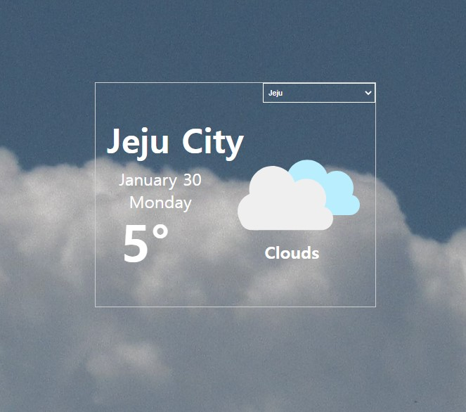
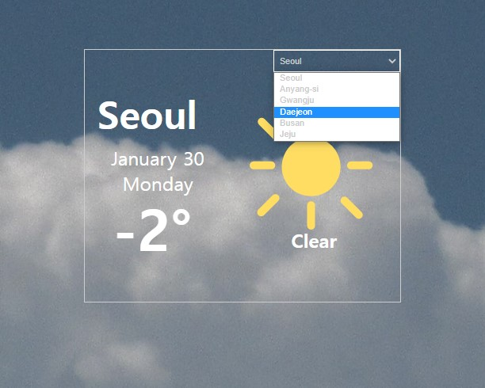

 <h1>Today's Weather app</h1>
  <h3>2022/12/14</h3>
  <ul>
    <li>API 가져오기</li>
    <li>도시 날씨/온도/상태 추가</li>
    <li>도시명 선택 변경 이벤트 추가 </li>
    <li>날씨 상태 마다 바뀌는 아이콘 이미지 추가 예정</li> 
  </ul>
  <h3>2022/12/15</h3>
    <ul>
    <li>주간/야간에 따라 배경이미지 변경</li>
    <li>날짜/요일 추가</li>
    <li>날씨 상태 마다 바뀌는 아이콘 이미지 추가</li>
  </ul>
  

  <h3>산출물 이미지</h3>
  
  
  
